# Model Comparison Report

Auto-generated by `src/evaluate.py` during training.

## Multi-class Classification Results

| Model | Accuracy | Precision | Recall | Weighted F1 | Macro F1 | ROC-AUC |
|-------|----------|-----------|--------|-------------|----------|---------|
| random_forest | 0.9948 | 0.9950 | 0.9948 | 0.9949 | 0.9813 | 0.9997 |
| decision_tree | 0.9929 | 0.9934 | 0.9929 | 0.9931 | 0.9657 | 0.9977 |
| svm | 0.8829 | 0.9242 | 0.8829 | 0.8983 | 0.5436 | 0.9720 |
| xgboost | 0.9966 | 0.9966 | 0.9966 | 0.9966 | 0.9871 | 1.0000 |
| mlp | 0.9898 | 0.9897 | 0.9898 | 0.9897 | 0.9582 | 0.9996 |

**Best model (weighted F1): `xgboost` — 0.9966**

## Binary Classification Results (Normal vs Attack)

| Model | Accuracy | Precision | Recall | Weighted F1 | ROC-AUC |
|-------|----------|-----------|--------|-------------|---------|
| random_forest | 0.9962 | 0.9964 | 0.9957 | 0.9962 | 0.9998 |
| decision_tree | 0.9947 | 0.9957 | 0.9934 | 0.9947 | 0.9970 |
| svm | 0.9262 | 0.9351 | 0.9097 | 0.9262 | 0.9784 |
| xgboost | 0.9962 | 0.9966 | 0.9955 | 0.9962 | 0.9999 |
| mlp | 0.9914 | 0.9914 | 0.9908 | 0.9914 | 0.9993 |

## Model Comparison Charts

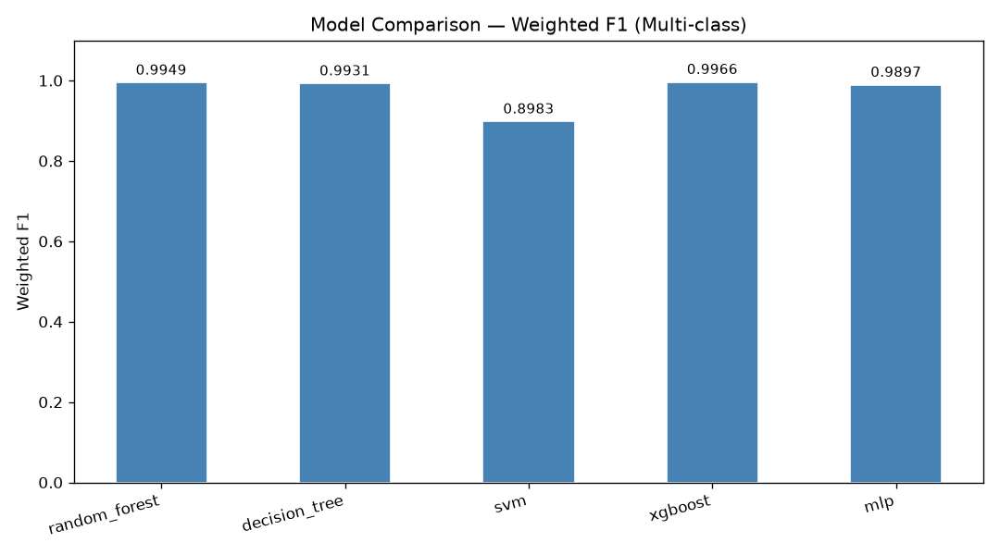
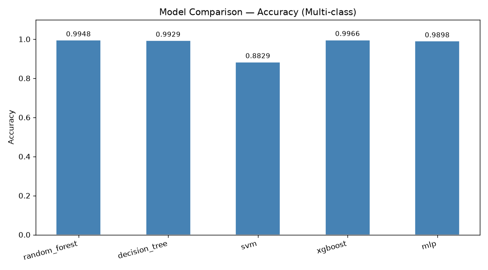

## Confusion Matrices (Multi-class)

### random_forest


### decision_tree
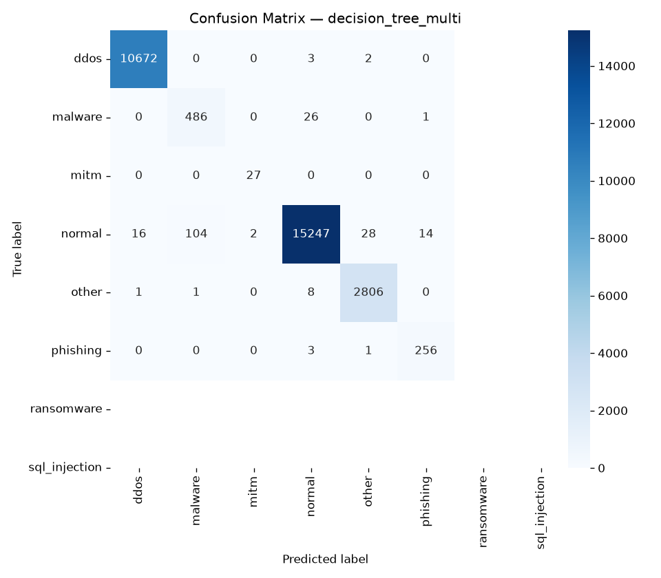

### svm
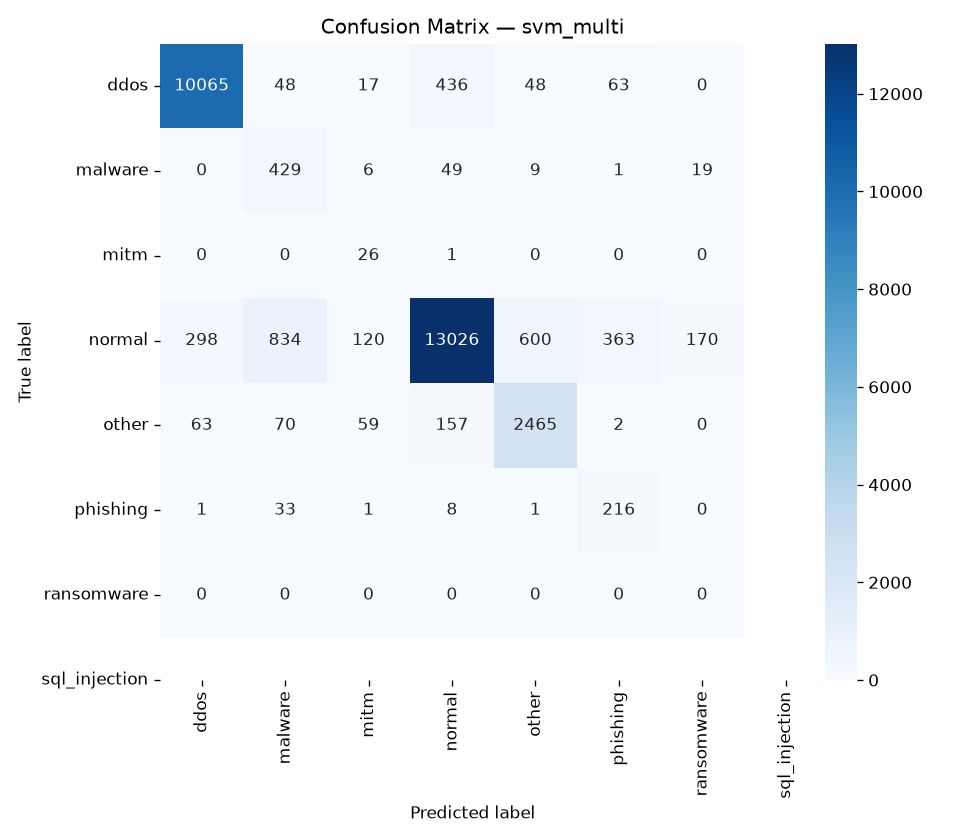

### xgboost
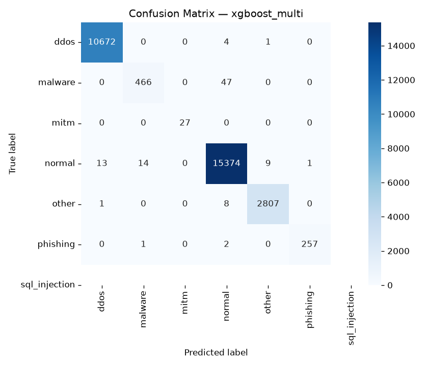

### mlp
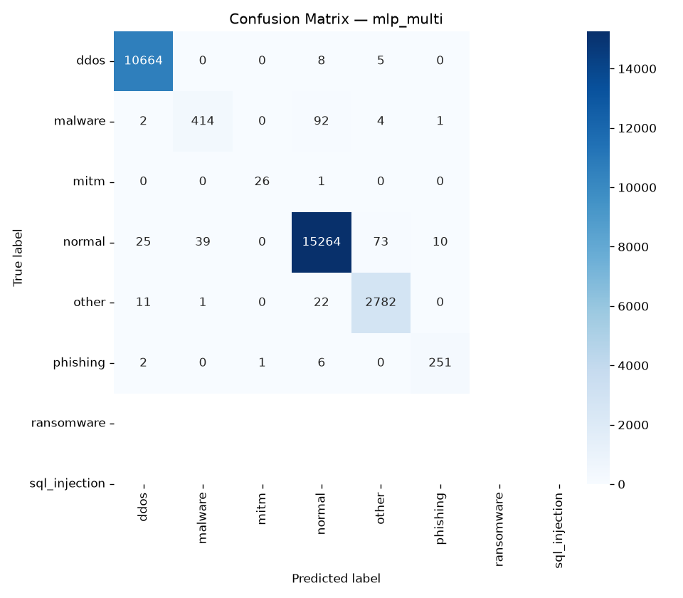

## ROC Curves (Multi-class)

### random_forest
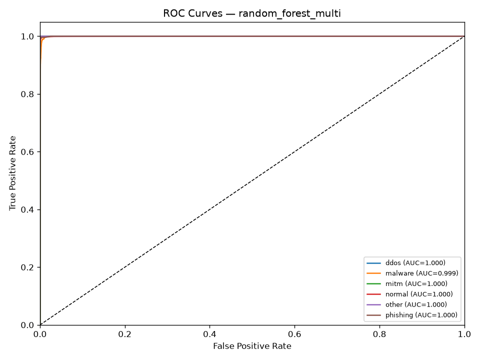

### decision_tree
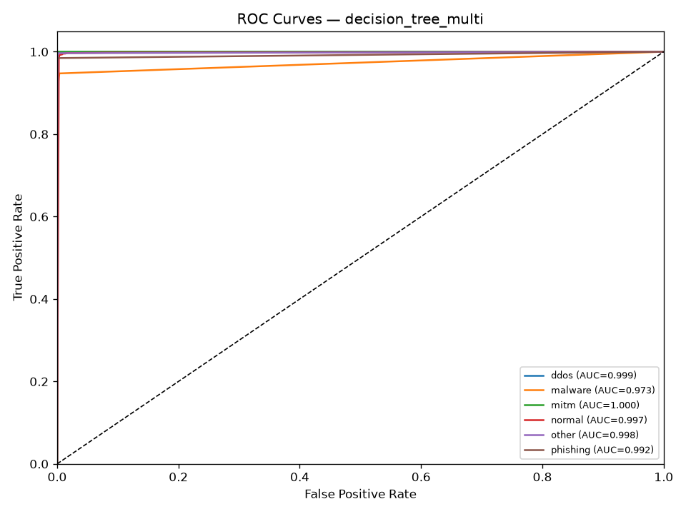

### svm
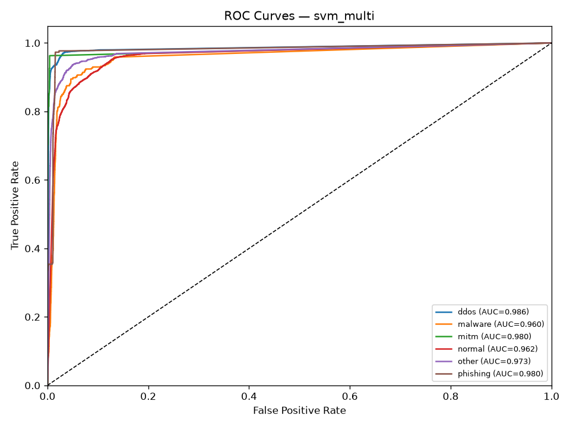

### xgboost
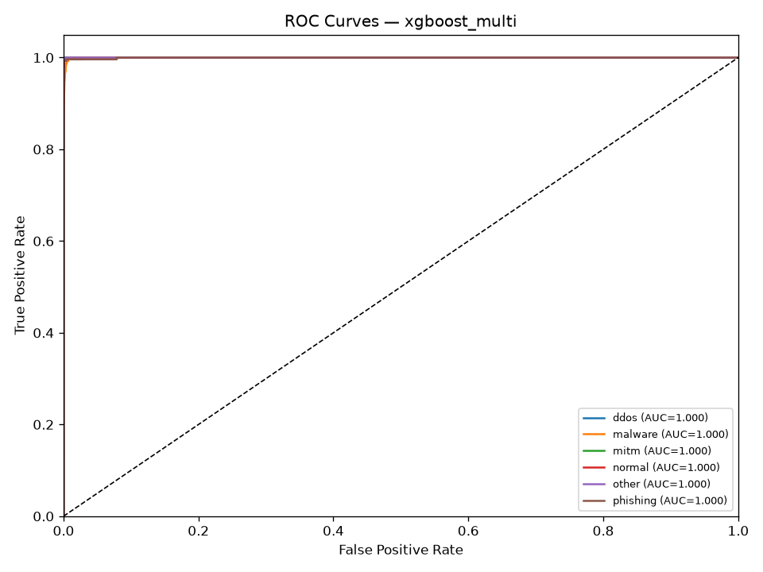

### mlp
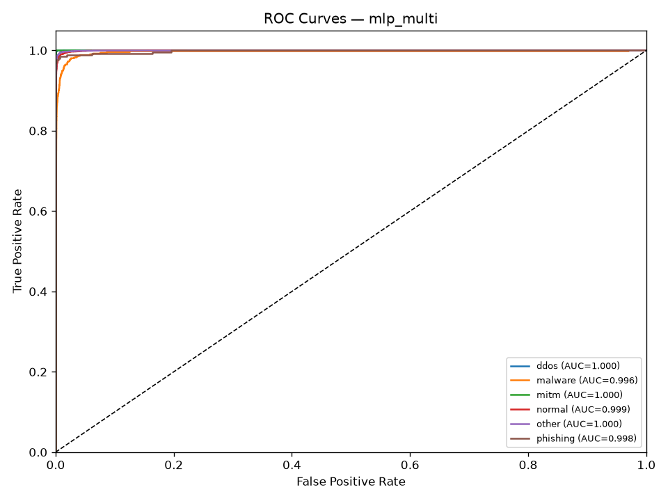

## Detailed Classification Reports

### random_forest — Multi-class
```
              precision    recall  f1-score   support

        ddos       1.00      1.00      1.00     10677
     malware       0.87      0.95      0.91       513
        mitm       1.00      1.00      1.00        27
      normal       1.00      0.99      1.00     15411
       other       0.99      1.00      0.99      2816
    phishing       1.00      0.98      0.99       260

    accuracy                           0.99     29704
   macro avg       0.98      0.99      0.98     29704
weighted avg       1.00      0.99      0.99     29704

```

### random_forest — Binary
```
              precision    recall  f1-score   support

      normal       1.00      1.00      1.00     15411
      attack       1.00      1.00      1.00     14293

    accuracy                           1.00     29704
   macro avg       1.00      1.00      1.00     29704
weighted avg       1.00      1.00      1.00     29704

```

### decision_tree — Multi-class
```
              precision    recall  f1-score   support

        ddos       1.00      1.00      1.00     10677
     malware       0.82      0.95      0.88       513
        mitm       0.93      1.00      0.96        27
      normal       1.00      0.99      0.99     15411
       other       0.99      1.00      0.99      2816
    phishing       0.94      0.98      0.96       260

    accuracy                           0.99     29704
   macro avg       0.95      0.99      0.97     29704
weighted avg       0.99      0.99      0.99     29704

```

### decision_tree — Binary
```
              precision    recall  f1-score   support

      normal       0.99      1.00      0.99     15411
      attack       1.00      0.99      0.99     14293

    accuracy                           0.99     29704
   macro avg       0.99      0.99      0.99     29704
weighted avg       0.99      0.99      0.99     29704

```

### svm — Multi-class
```
               precision    recall  f1-score   support

         ddos       0.97      0.94      0.95     10677
      malware       0.30      0.84      0.45       513
         mitm       0.11      0.96      0.20        27
       normal       0.95      0.85      0.90     15411
        other       0.79      0.88      0.83      2816
     phishing       0.33      0.83      0.48       260
sql_injection       0.00      0.00      0.00         0

     accuracy                           0.88     29704
    macro avg       0.49      0.76      0.54     29704
 weighted avg       0.92      0.88      0.90     29704

```

### svm — Binary
```
              precision    recall  f1-score   support

      normal       0.92      0.94      0.93     15411
      attack       0.94      0.91      0.92     14293

    accuracy                           0.93     29704
   macro avg       0.93      0.93      0.93     29704
weighted avg       0.93      0.93      0.93     29704

```

### xgboost — Multi-class
```
              precision    recall  f1-score   support

        ddos       1.00      1.00      1.00     10677
     malware       0.97      0.91      0.94       513
        mitm       1.00      1.00      1.00        27
      normal       1.00      1.00      1.00     15411
       other       1.00      1.00      1.00      2816
    phishing       1.00      0.99      0.99       260

    accuracy                           1.00     29704
   macro avg       0.99      0.98      0.99     29704
weighted avg       1.00      1.00      1.00     29704

```

### xgboost — Binary
```
              precision    recall  f1-score   support

      normal       1.00      1.00      1.00     15411
      attack       1.00      1.00      1.00     14293

    accuracy                           1.00     29704
   macro avg       1.00      1.00      1.00     29704
weighted avg       1.00      1.00      1.00     29704

```

### mlp — Multi-class
```
              precision    recall  f1-score   support

        ddos       1.00      1.00      1.00     10677
     malware       0.91      0.81      0.86       513
        mitm       0.96      0.96      0.96        27
      normal       0.99      0.99      0.99     15411
       other       0.97      0.99      0.98      2816
    phishing       0.96      0.97      0.96       260

    accuracy                           0.99     29704
   macro avg       0.97      0.95      0.96     29704
weighted avg       0.99      0.99      0.99     29704

```

### mlp — Binary
```
              precision    recall  f1-score   support

      normal       0.99      0.99      0.99     15411
      attack       0.99      0.99      0.99     14293

    accuracy                           0.99     29704
   macro avg       0.99      0.99      0.99     29704
weighted avg       0.99      0.99      0.99     29704

```
